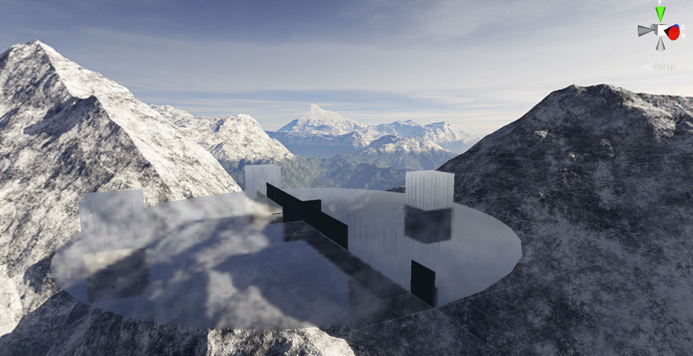
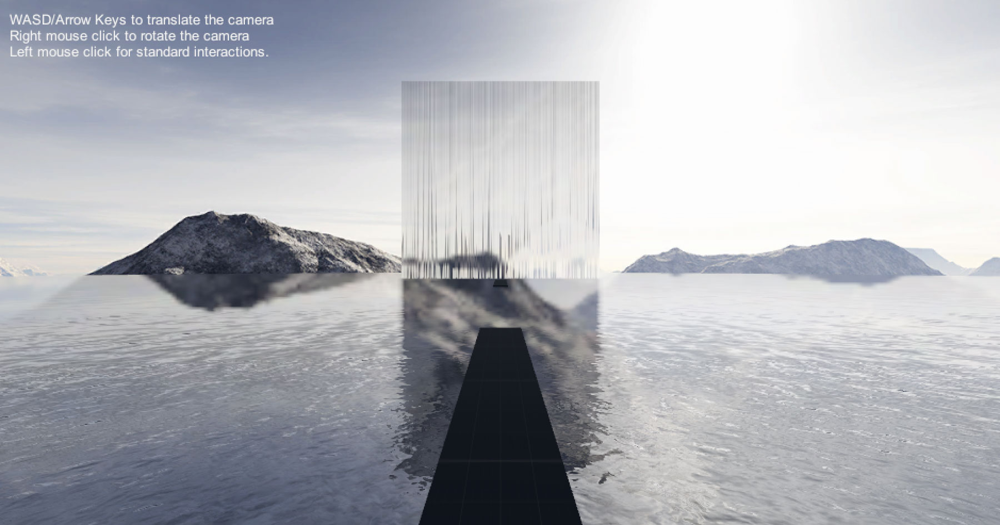
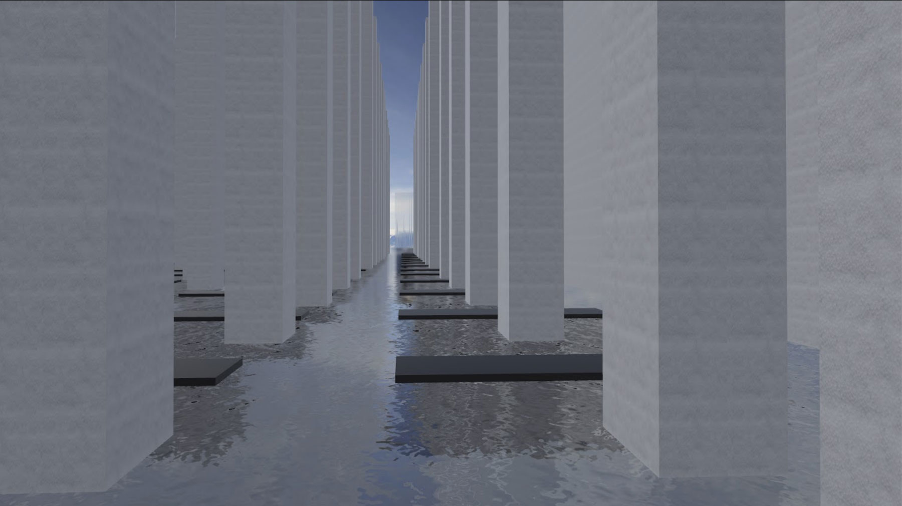
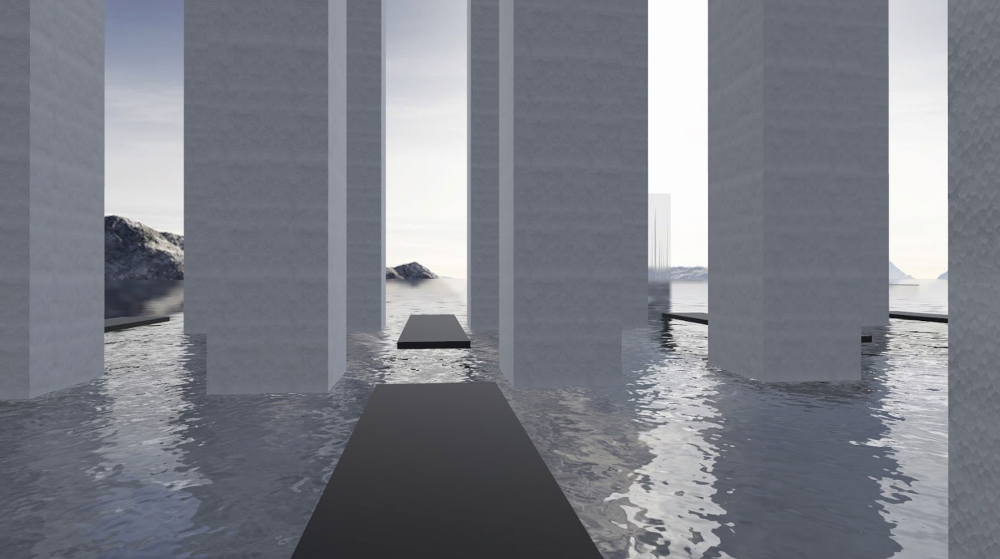
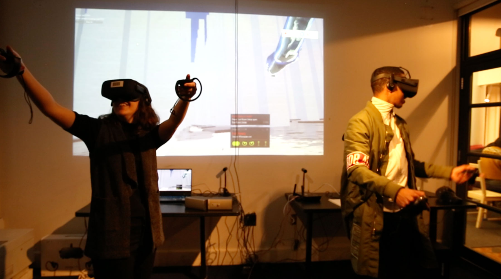
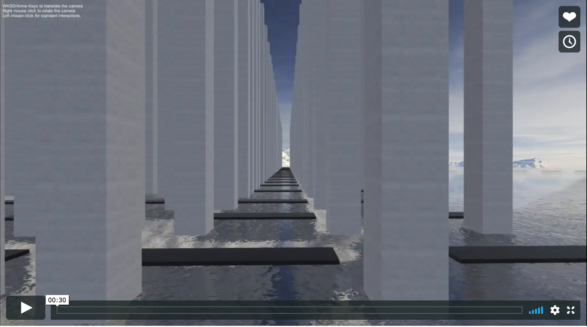
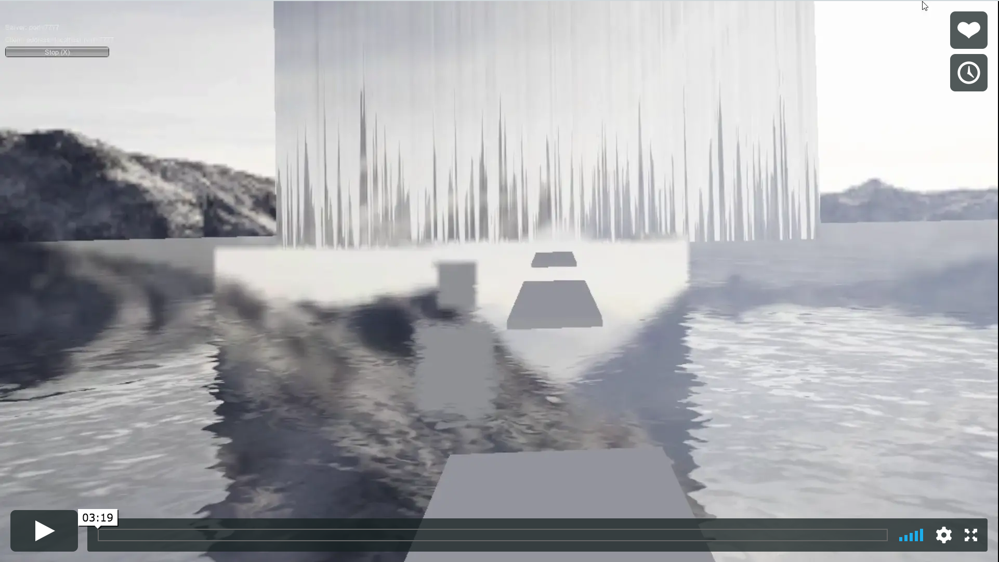

## March 5, 2019 Update
In Memoriam is an open-ended, multi-user virtual reality experience that presents a future in which nature is preserved 
in synthetic monuments. Two participants enter a surreal world of plastic trees, open water, and forest sounds from the past. Entering at two different locations in the landscape, guests are tasked to find each other while exploring the artificial forest. 

We are honored and excited to participate in [ITP's xStory Experiments in Storytelling](https://www.itpxstory.com/)!

This repo will log our progress as we develop the project.

<strong>Some Background</strong> 
This project began in Igal Nassima's Fall 2018 course, [Desert of the Real: Deep Dive into Social VR](https://github.com/igaln/DesertOfTheReal), at [NYU ITP](https://tisch.nyu.edu/itp). 

During the initial phase of development, we:
<ul>
<li>Developed the initial story world, including the narrative, characters, environment, and interactions.</li>
<li>Built a basic environment with audio and visual content in Unity.</li>
<li>Designed and rigged an avatar.</li>
<li>Programmed networking for two participants to share the experience at the same time.</li>
<li>Prototyped IRL onboarding and exit design through a couple rounds of user testing with our ITP colleagues.</li>
</ul>

As part of xStory, we plan to:
<ul>
<li>Further develop the experience narrative and character storylines.</li>
<li>Consider avatar entry points into the virtual environment and any event(s) to occur upon finding each other there.</li>
<li>Collect more sounds to create a more elaborate soundscape.</li>
<li>Refine avatar design and rigging with more advanced software options for a more “natural” presentation.</li>
<li>Rework avatar teleport animation for smoother movements.</li>
<li>Focus on the user experience to plan onboarding and exiting elements, such as stage design, script, and additional experience guidance. 
</ul>

<strong>Current Status</strong> 
Last week we launched the project for the first time since December and ran into a few issues to solve: our player's "bridge" to its SteamVR objects seems broken and hence our avatar is missing and the teleporting is broken. Strange to encounter new errors even though we haven't touch the project since last semester. However, we noticed a SteamVR update from 1.1.4 to 1.2.10. Either we're missing something easy or perhaps the errors are related to that update...? If we are unable to solve this on our own, we'll seek help from more experienced developers.

In the meantime, we've decided focus on content refinement, which includes research into various plastics and the collection and spatialization of sounds.

<strong>Reference Images and Videos</strong> 

User Testing in December 2018

Screen Recording: Environment

Screen Recording: In Headset

