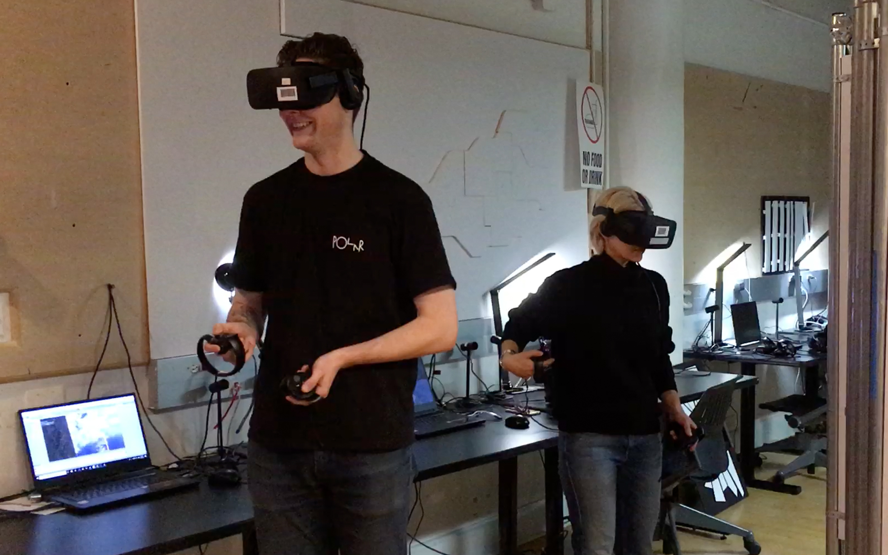
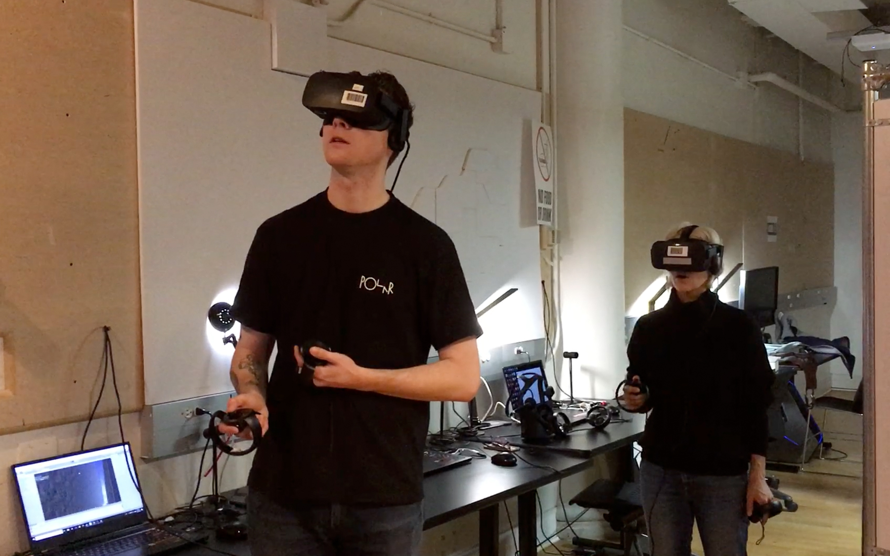
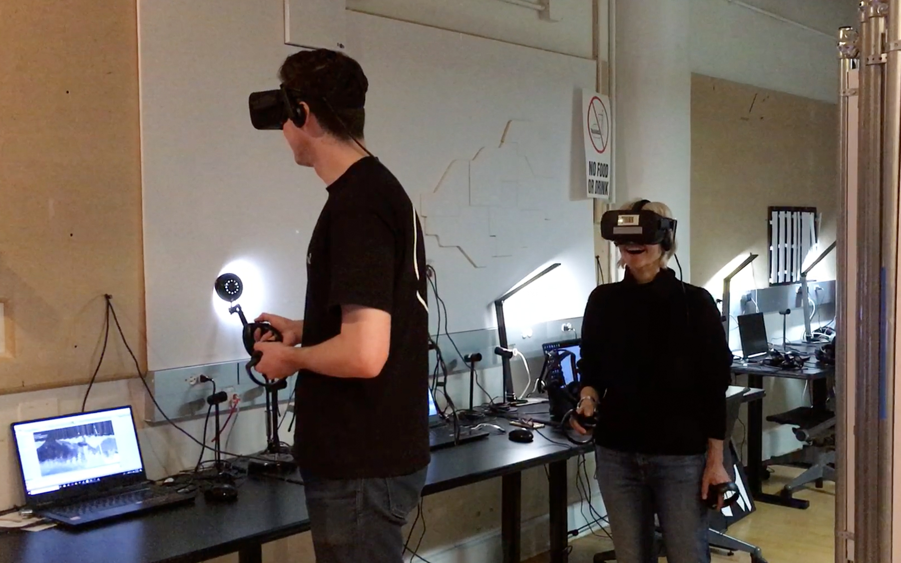
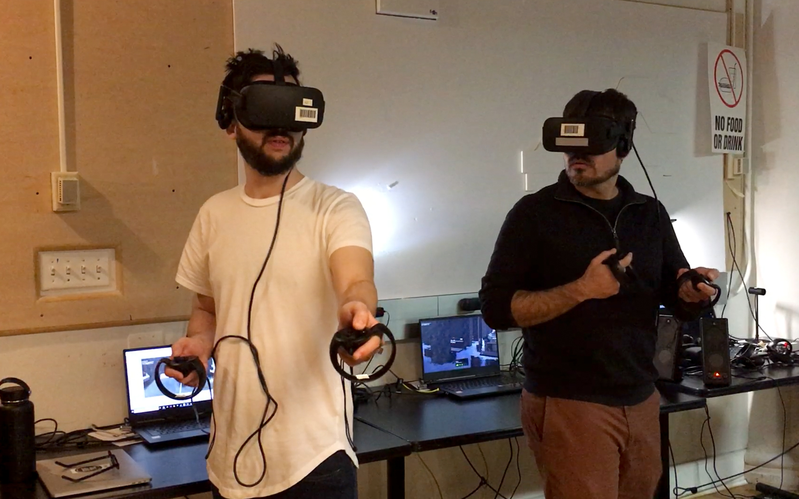
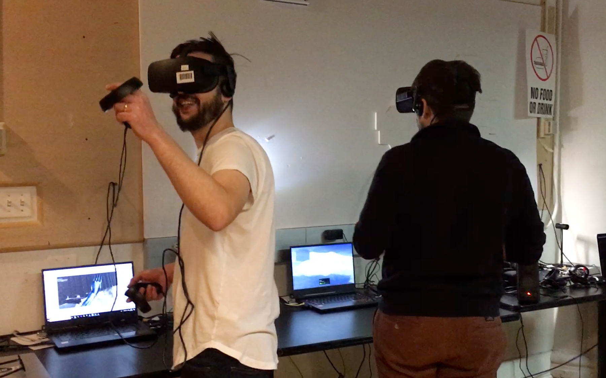

## March 29, 2019 Update

During the past few weeks, we worked on both the technical and experiential sides of our project. We developed a simple onboarding experience and conducted some user research. Below are more details about this, including our notes from the user tests and our next steps.

<strong>Updates</strong> 
<ul>  
  <li>Developed an onboarding experience with an onboarding script and instructions</li>  
  <li>Further developed the narrative and character storylines</li>  
  <li>Created a dynamic soundscape with added natural and artificial sounds</li>  
  <li>Changed the material of the “trees” in our existing environment to a darker, more memorial-like material.</li>  
  <li>Conducted user testings with people who are VR experts and those who are a little less familiar with VR experiences</li> 
</ul>

<strong>User Testing</strong> 
<ul>   
  <li><strong>Onboarding:</strong> Overall we received positive feedback regarding the onboarding experience. Both groups think it is very important for setting the mood of our piece. The details can be more refined and there is potential to design the space IRL to help prepare participants for the VR experience.</li>  
  <li><strong>Beginning of the VR experience:</strong>
Before the participants are able to explore the forest, it’d be nice to add in a buffer of some sort in which they can spend some time with their avatars and sync their minds with the environment, this could be done by temporarily taking away their ability to teleport, or by starting them in a darker space with limited view.</li>  
  <li><strong>Communication between participants:</strong> 
There were great communications between the participants in both groups. Both groups figured out the hidden goal of the experience was to find the other participant by communicating what they saw and heard. We should consider giving the participants real or mock walkie talkies as a device for communication to add to the experience. Distorting the participants’ voices would also help with differentiating the IRL experience from the in-headset experience.</li>  
  <li><strong>Sounds:</strong> 
In general people enjoyed listening to the sounds and using them to locate themselves in the forest. It was recommended to refine the sound design with more deliberate choices. We can also consider adding some user interactions to trigger some of the sounds.</li> 
  <li><strong>Environment:</strong> 
People liked the grandness of the structure and the open space that surrounds it. Similar to the sound design, we can also fine-tune the forest with architectural elements to craft a more intentional user experience. The waterfall cubes at the edges of the world should probably include more features or surprises than they currently do. </li> 
</ul>

<strong>Next Steps</strong>
<ul>
  <li>Test out different architectural elements in the environment to see what they add to the experience</li>
  <li>Refine the onboarding experience</li>
  <li>Refine the soundscape design</li>
  <li>Conduct another round of user research to test these updates</li>
</ul>  

<strong>Documentation</strong>

